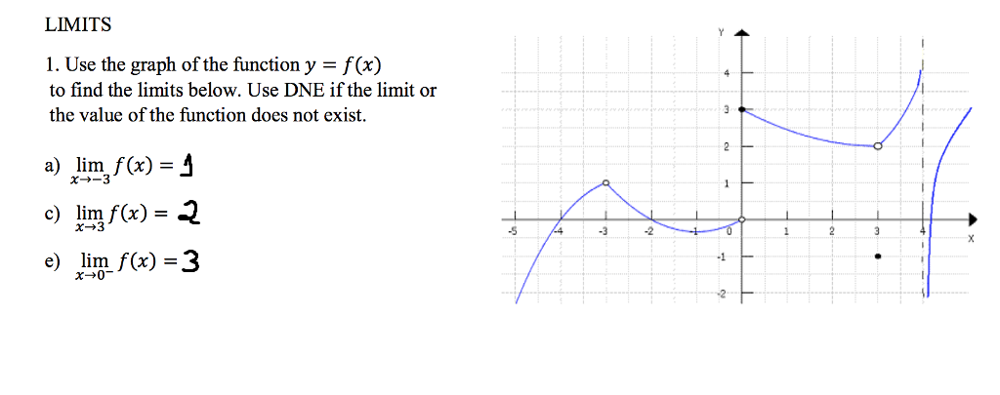
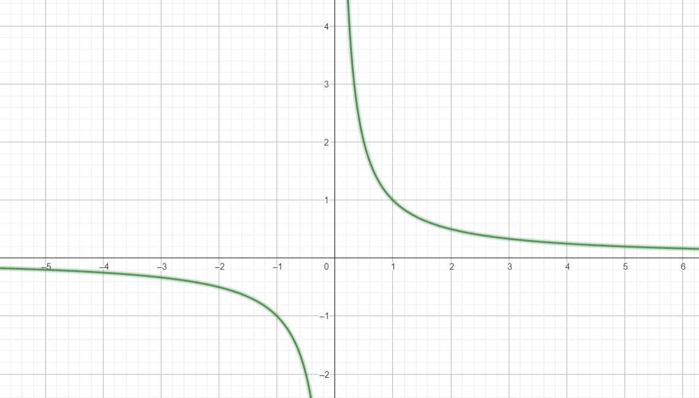

# Mathematics-Data-Science

- [Calculus](#1.0-calculus)
    - [Limits](#1.1-limits)
    - [Limits Rules](#1.2-limits-rules)
    - [Limits Infinity](#1.3-limits-infinity)
    - [Derivatives](#1.4-derivatives)
    - [Derivatives Example](#1.4.1-derivatives-example)

- [Statics and Probability](#2.0-statics)
    - 2.1 Descritive

- [Linear Algebra](#3.0-linear-algebra)
    - 1.1

## 1.0 Calculus {#1.0-calculus}
Motivação: permite entender fenômenos importantes em um ambiente, como a velocidade instântanea de um objeto.
Aplicado a ML e DL, podemos gerar "gradientes", que são uma forma de atingir uma otmização de uma equação. Ou seja, uma forma de aprender. 

### 1.1 Limits {#1.1-limits}
Definição Intuitiva: Em um plano contínuo representando uma função que pertence aos números reais, ou seja, pode abranger infinitos valores entre dois pontos específicos, o limite de uma função é dado como o resultado - ou talvez o comportamento - da função quando o valor de x se aproxima infinitamente de um ponto determinado. No exemplo abaixo, o limite de f(x) quando x tende a "a" é igual L
\[ \lim_{x \to a} f(x) = L \]

Logo, devido a sua capacidade, os limites são úteis para enterdemos a tendência de uma função, por mais bizarra que ele possa ser. Por exemplo:

#### 1.2 Limits Rules {#1.2-limits-rules}
-Distributiva: o limite pode ser distriuído na soma, subtração, multiplicação ou divisão de duas funções ou mais funções
-Comutatividade sobre constantes: a constante que multiplica uma função em um limite pode ser colocada antes ou depois a execução do limite. Em essência, isso também é válido para a exponenciação e raízes.

Em resumo:

#### 1.3 Limits Infinity {#1.3-limits-infinity}
Na matemática, podem existir funções que tentam alcançar um valor, sempre se apróximando dele, mas nunca verdadeiramente o atingindo. 
Por exemplo, a função 1/x tende sempre a buscar o valor 0, mas nunca de fato o toca.

Disso, temos que \[\lim_{{x \to \infty}} \frac{1}{x} = 0\]
Ou seja, quanto mais x cresce, mais próximo de 0 ele fica. Logo, ele tende ao infinito, que nunca será atingido, já que ele é infinito.

De outra forma, podem existir funções que tendem ao infinito, resultando uma resposta infinita, e funções que tendem ao infinito, mas a resposta simplesmente não existem, como lim x→∞​ sin(x). Nesse último caso, isso ocorre porque a função seno oscila entre 1 e -1, então mesmo que x cresça infinitamente, ela não vai converger.

Por fim, deve-se pontuar que existem infinitos negativos ou positivos, que devem ser usados conforme a função que se análisa. Além disso, certas operações com infinitos podem gerar números indeterminados (diferentes de não exister), por exemplo infinito/infinito.
OBS: As vezes, é possível fugir desses números indeterminados fazendo manipulações nas fórmulas.

### 1.4 Derivatives {#1.4-derivatives}
Imagine uma curva que represente algum fenômeno, como a velocidade não uniforme de um objeto. Podemos calcular a variação desse fenômeno definindo dois pontos e fazendo a divisão de sua diferença em seus eixos ((y2-y1)/(x2-x1)). Se aproximarmos o ponto mais distante (p2) do primeiro ponto (p1), a reta secante que antes tocava apenas dois pontos, tenderá a tocar somente um ponto.

Disso, podemos definir a derivada como o limite da aproximação da reta secante em um determinado ponto. Na prática a derivada nos retorna um vértice em um gráfico contínuo.
A derivada de \( f(x) \) em relação a \( x \), denotada por \( f'(x) \) ou \( \frac{df}{dx} \), é definida como:

\[ f'(x) = \lim_{{h \to 0}} \frac{f(x + h) - f(x)}{h} \]
"h" tender a 0 significa que a distância entre os pontos tende a 0.
No exemplo de um corpo em movimento, esse cálculo trará a velocidade instantânea.

Deve-se pontuar que nem todas funções podem ser derivadas. Alguns exemplos que não podem ser derivados (by chat gpt):
 - Descontinuidades: Uma função não deve ter descontinuidades abruptas para ser derivável. Descontinuidades podem ocorrer em pontos isolados ou ao longo de um intervalo.
 - Pontos angulosos ou cúspides: A presença de pontos angulosos ou cúspides na curva da função pode indicar a falta de derivabilidade nesses pontos. Cúspides são pontos onde as retas mudam a difereção
 - Assimetria extrema: Funções altamente assimétricas, especialmente aquelas com comportamento oscilante excessivo, podem apresentar dificuldades de derivabilidade em alguns pontos.
 - Divisão por zero: Se a função envolve uma divisão por zero em algum ponto, a derivada pode não existir nesse ponto.

#### 1.4.1 Derivatives Example {#1.4.1-derivatives-example}

Fonte: https://socratic.org/questions/how-do-you-find-the-derivative-using-limits-of-f-x-3x-2

### 2.0 Statics {#2.0-statics}

### 3.0 Linear Algebra {#3.0-linear-algebra}
